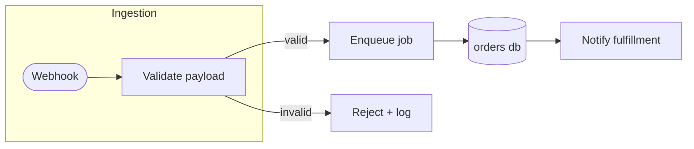

# /diagram — Description or Code → Diagram

## Usage
```
/diagram <subject>                — Mermaid diagram of a description, file, module, or flow
/diagram --excalidraw <subject>   — same, plus an editable .excalidraw JSON file
```

**Iron rule: never deliver an unvalidated diagram.** A Mermaid block with a syntax error renders as an error box exactly where the user wanted clarity. Validate before delivering, every time.

## Argument Parsing

Parse `$ARGUMENTS`: extract the `--excalidraw` flag; the rest is the subject — a prose description, a file/module path (read it and diagram what the code actually does, not what it "should" do), or a reference to something discussed in the conversation.

---

## Phase 1: Choose the Diagram Type by Content

Do not default blindly to flowchart — match the type to what the content IS:

| Content | Mermaid type | Signal |
|---------|--------------|--------|
| Process, pipeline, architecture, decision logic | `flowchart` (`graph LR`/`TD`) | Steps, branches, components and their connections |
| Interactions over time between actors/services | `sequenceDiagram` | "A calls B, B responds", requests, protocols, auth flows |
| Data model, tables, entities | `erDiagram` | Schemas, foreign keys, "has many" |
| Lifecycle, modes, statuses | `stateDiagram-v2` | An entity that transitions between named states |
| Class/type structure | `classDiagram` | Inheritance, interfaces, OO relations |
| Schedule, phases over dates | `gantt` | Timelines, milestones |

If the subject genuinely spans two types (e.g. architecture + one critical call sequence), produce two small diagrams — never force one type to do the other's job.

## Phase 2: Author — Layout Quality Rules

- **Direction**: `graph LR` for pipelines and data flows (reads like a sentence); `graph TD` for hierarchies and decision trees.
- **5–15 nodes is the readable range.** More than 15 → split into an overview diagram plus detail diagrams, and say why.
- **Short node labels** (≤ 4 words); put detail on edge labels, not inside boxes.
- Group related nodes with `subgraph` blocks (e.g. per service, per layer).
- Declare nodes in reading order — Mermaid lays out in declaration order, and a thoughtful order minimizes edge crossings.
- Use consistent shapes with meaning: `[rect]` process, `{diamond}` decision, `([stadium])` start/end, `[(db)]` datastore. Don't mix shapes decoratively.

Common Mermaid syntax traps — check while writing:

| Trap | Fix |
|------|-----|
| A node id named `end` breaks flowcharts | Use `End`, `finish`, or quote it |
| Labels containing `(` `)` `[` `]` `{` `}` `|` `;` | Quote the label: `A["fetch (retry x3)"]` |
| Actor names with spaces in sequence diagrams | `participant db as "Primary DB"` |
| Wrong arrow for the type | Flowchart `-->`, sequence `->>` / `-->>`, state `-->` |
| Comments | `%%` only — `//` and `#` are syntax errors |
| erDiagram cardinality | `USER ||--o{ ORDER : places` — the label after `:` is required |

## Phase 3: Validate

Preferred — actually render it:

```bash
npx -y @mermaid-js/mermaid-cli -i /tmp/<slug>.mmd -o /tmp/<slug>.svg
```

Exit 0 with an SVG produced = valid. On a parse error: read the error, fix the source, re-run — never hand the user broken source. If `mmdc` cannot run in this environment (no headless Chrome), fall back to a manual pass: re-check every line against the trap table above and the declared diagram type's arrow/keyword grammar, and say the diagram was syntax-checked but not render-verified.

## Phase 4: Deliver — Embed Where the User Needs It

- Target is a markdown file (README, doc, PR description): insert the fenced ` ```mermaid ` block at the right section of that file. GitHub and most viewers render it natively.
- Conversation ask: print the fenced block in the reply.
- Standalone request or unclear target: write `diagrams/<slug>.mmd` in the repo (kebab-case slug from the subject, ≤ 40 chars) and tell the user where it is.

For docs generation pipelines, prefer embedding the Mermaid source over exporting images — source diffs, images don't. (Pairs with `/document` for architecture explanations and `/make-pdf`, which renders mermaid fences.)

## Phase 5: `--excalidraw` — Editable Scene Export

Also emit `<slug>.excalidraw` — a JSON scene the user can open at excalidraw.com (File → Open), rearrange, and keep working on.

Top-level shape:

```json
{"type": "excalidraw", "version": 2, "source": "claude-skills-kit", "elements": [], "appState": {"viewBackgroundColor": "#ffffff"}, "files": {}}
```

Element rules (the subset that produces a valid, editable scene):

| Element | Required fields |
|---------|----------------|
| Node box | `{"id","type":"rectangle","x","y","width":220,"height":90,"strokeColor":"#1e1e1e","backgroundColor":"transparent","fillStyle":"solid","strokeWidth":1,"roughness":1,"opacity":100,"angle":0,"seed":<int>,"version":1,"versionNonce":<int>,"isDeleted":false,"groupIds":[],"frameId":null,"boundElements":[{"id":"<textId>","type":"text"},{"id":"<arrowId>","type":"arrow"}],"updated":<epoch-ms>,"link":null,"locked":false}` |
| Label | Same base fields with `"type":"text"`, plus `"text","fontSize":16,"fontFamily":1,"textAlign":"center","verticalAlign":"middle","containerId":"<boxId>","originalText":<same as text>,"lineHeight":1.25` |
| Arrow | Same base fields with `"type":"arrow"`, `"points":[[0,0],[dx,dy]]`, `"startBinding":{"elementId":"<fromBoxId>","focus":0,"gap":4}`, `"endBinding":{"elementId":"<toBoxId>","focus":0,"gap":4}`, `"startArrowhead":null,"endArrowhead":"arrow"` |

Layout: mirror the Mermaid ranks on a grid — 220×90 boxes, 80px horizontal and 60px vertical gaps; LR ranks become columns, TD ranks become rows. Every element referenced by a `boundElements`/`containerId`/binding must exist with that exact id.

Validate the JSON parses before delivering: `node -e 'JSON.parse(require("fs").readFileSync(process.argv[1],"utf8"))' <slug>.excalidraw` (or `python3 -m json.tool`).

Flowcharts map cleanly to excalidraw. For sequence/ER/state types, export a boxes-and-arrows approximation and tell the user: "the .excalidraw is an editable approximation — the .mmd source stays the source of truth."

## Output

```
## Diagram: <subject>

Type: <mermaid type> — <one-line reason for the choice>
Validated: rendered with mermaid-cli ✅ / syntax-checked (render unavailable) ⚠️

<the fenced mermaid block, or "Embedded in <file> at '<section>'">

Files: diagrams/<slug>.mmd [, diagrams/<slug>.excalidraw — open at excalidraw.com, File → Open]
```

If the user wants changes: edit the `.mmd` source and re-run Phases 3–5 — the Mermaid source is always the single source of truth.

## Worked Example (quality rules applied)



Why this passes the bar: `graph LR` because it is a pipeline; 6 nodes; detail lives on the edge labels (`valid`/`invalid`); shapes carry meaning (stadium start, rects for steps, cylinder for the datastore); declaration order matches reading order, so no crossing edges.
